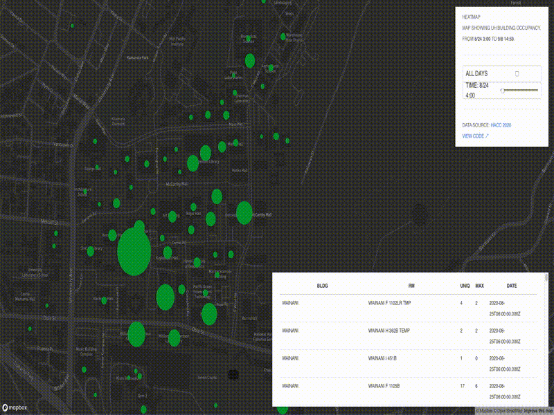
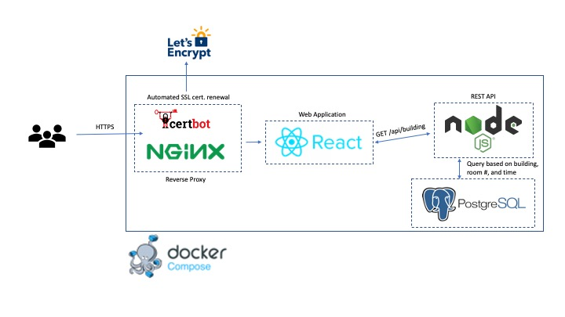

# HACC 2020 - UH Occupancy Visualizations
Visualizing room occupancy on the UH Manoa campus through the use of unique WiFi connections.

## Demo

[Link to Demo](https://hacc.kauaitechgroup.com)



**Note to judges and onlookers:** The largest remaining bug fix is the appearance of the app, which will be fixed now until the presentation.

## Overview



## Running the web-app
Clone the repository:
```
git clone https://github.com/HACC2020/Kauai-Technology-Group.git
```
To run the application, you'll need to sign up for a [Mapbox API token](https://docs.mapbox.com/help/how-mapbox-works/access-tokens/) (it's free). Environment variables are used to protect the key during production, both React and Docker make this convenient:

1. Create environment variables for the API URL and Mapbox access Token:
```
#filename - web-app/heatmap/src/.env
REACT_APP_BACKEND_API=http://127.0.0.1:3001/v1
REACT_APP_MapboxAccessToken=<your_access_token>
```
For an example of that in action, see `web-app/heatmap/src/app.js`. Environment variables need to be prepended with `REACT_APP_`.

2. Create environment variables for the database:
```
#filename - web-app/.env
PGUSER=postgres
PGHOST=postgres
PGDATABASE=postgres
PGPASSWORD=<your_great_password>
PGPORT=5432
```

To start up the development containers for hot-reloading:
```
cd web-app
docker-compose up --build
```

To start up the production containers:
```
cd web-app
docker-compose -f docker-compose.pro.yml up --build
```

### API Endpoints


## Running the Jupyter Notebooks:
An easy way to start with data science notebooks are provided [by Jupyter](https://github.com/jupyter/docker-stacks). In this directory, run:

```
docker build -t uh_density
docker run --rm -p 8888:8888 -e JUPYTER_ENABLE_LAB=yes -v $PWD:/home/jovyan/work uh_density:latest
```

The terminal will provide a URL to access through your browser.

---

## FAQ
* Why React?

* Why the full blown SQL database?

* Why use MapBox, as opposed to another platform like Google Maps or Leaflet?

* Are there any interesting characteristics shown in the data?

